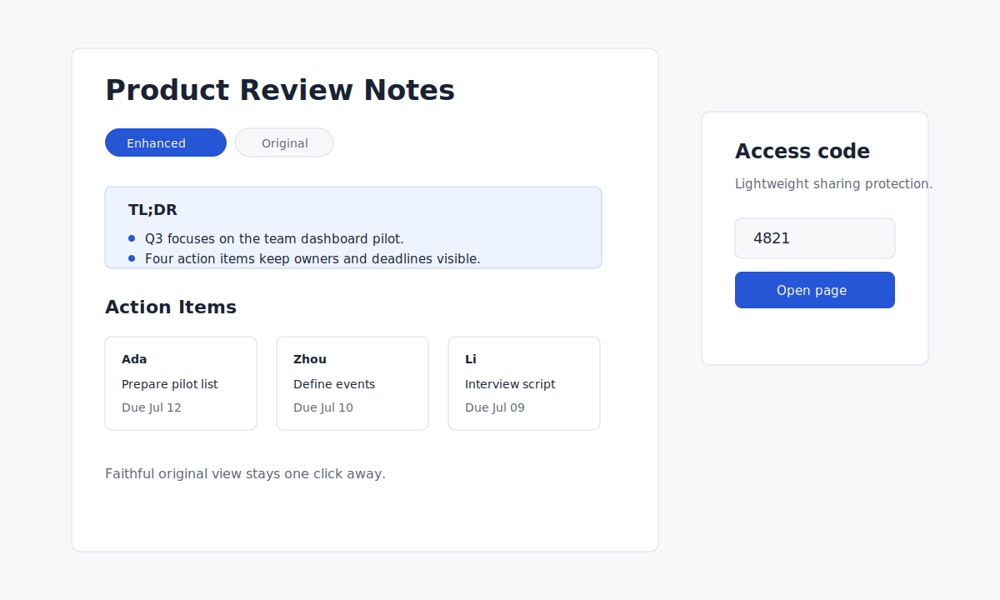

# htmlshare

[](https://github.com/neowangx/htmlshare/actions/workflows/ci.yml)

[English](README.md) | [简体中文](README.zh-CN.md)

Publish AI-generated Markdown or self-contained HTML as a polished shareable page: readable layout, faithful original view, stable link, and a lightweight access code.



## 30-Second Start

Install with one line (detects Claude Code, Codex, OpenClaw, and Hermes and installs into each):

```sh
curl -fsSL https://raw.githubusercontent.com/neowangx/htmlshare/main/install.sh | bash
```

Then make sure `~/.local/bin` is on your `PATH` and tell your agent: `分享 ./note.md`.

To install from a local checkout instead (used by the test suite, writes only under throwaway temp dirs):

```bash
HOME="$(mktemp -d)" HTMLSHARE_SOURCE_DIR="$PWD" HTMLSHARE_INSTALL_DIR="$(mktemp -d)/htmlshare" bash ./install.sh
```

Check the CLI:

```bash
node ./bin/htmlshare.js --help
```

After install, ask your agent to share a file, or run `htmlshare publish ./note.md`. htmlshare keeps a faithful original view and, for Markdown, lets the host agent add an enhanced reading view.

Official Studio/cloud is the default zero-setup path: sign in with `htmlshare login`, publish without managing a server, and start with 100MB free storage. Need more space? Upgrade the official service, or configure your own Vercel, Cloudflare, or compatible self-hosted target.

## What Is Open Source

This repository contains the cross-agent skill, CLI, local configuration, templates, styles, static adapters, cloud/selfhost protocol adapters, and the protocol documentation. The official hosted cloud server implementation is not part of the open-source product. If you use the official Studio/cloud option, the open-source CLI talks to that service through the documented API.

If you want to run your own compatible endpoint, see [server/README.md](server/README.md). Content responsibility belongs to the person publishing and the platform they choose.

htmlshare can coexist with mdshare. Commands, config, cache, and manifest paths are separate.

## Targets

| Target | Best For | Setup | Access Code |
|---|---|---|---|
| official cloud | zero operations, stable default sharing | `htmlshare login` | server-side gate |
| Vercel | static hosting on your own account | Vercel CLI login | static encrypted shell |
| Cloudflare Pages | static hosting on your own account | Wrangler login | static encrypted shell |
| selfhost | your own compatible server | base URL + upload token | server-side gate |

Official cloud starts with 100MB free storage. Larger official quotas are paid; Vercel and Cloudflare usage depends on your own accounts.

If you have your own VPS or server, configure `selfhost` first and publish through your own endpoint. If you do not have one, skip that setup and use Cloudflare Pages or Vercel instead.

## Templates And Styles

Templates organize information. Styles change the visual theme. They are independent.

| Template | Slots |
|---|---|
| `generic` | `body` |
| `meeting` | `conclusions`, `actions`, `open_issues`, `discussion` |
| `proposal` | `summary`, `problem`, `solution`, `plan`, `risks` |
| `tutorial` | `overview`, `prerequisites`, `steps`, `faq` |
| `release` | `highlights`, `changes`, `upgrade_notes` |

| Style | Use When |
|---|---|
| `clinical` | business, meetings, proposals; the default |
| `minimal` | long text, notes, essays |
| `editorial` | public reading, tutorials, announcements |
| `darktech` | code-heavy developer material |

## Safety Notes

Access codes are lightweight sharing protection, not strong secrecy. Do not publish credentials, legal evidence, medical/financial secrets, or anything that must never leave your machine.

Enhanced pages are reading aids. Facts, numbers, names, dates, commitments, and code blocks must stay exact, and the faithful original view is always the fallback source of truth.

HTML direct upload preserves the file you provide. If you publish arbitrary HTML, responsibility for that HTML belongs to you.

## Useful Commands

Inspect current config:

```bash
HOME="$(mktemp -d)" node ./bin/htmlshare.js config show
```

Typical installed usage:

- `htmlshare login`
- `htmlshare publish ./note.md`
- `htmlshare list`
- `htmlshare unpublish ./note.md --yes`
- `htmlshare config selfhost --base-url https://share.example.com --token <token>`
- `htmlshare config defaults style minimal`

## FAQ

**What if enhancement fails?**
htmlshare publishes the faithful original version and reports the reason.

**What if the agent changes a fact?**
That is a bad enhancement. The faithful original view is always present and should be treated as authoritative.

**Can I update a link?**
Yes. Publishing the same source to the same target updates the existing manifest entry when the adapter supports stable ids.

**Can I revoke a page?**
Use `htmlshare unpublish`. Static platforms can have CDN cache delay; server-side targets can remove access immediately.

**The network dropped mid-publish — do I lose the conversion?**
No. The converted artifact is cached, so re-running the same publish reuses it (`CACHE: hit CONVERT`) and only retries the upload. Transient upload failures are retried automatically.

**My Vercel/Cloudflare login expired.**
The CLI exits with an `UNAUTHORIZED` upload error. Re-run `npx vercel login` (or `npx wrangler login`) and publish again; the cached artifact is reused.

**I forgot a page's access code.**
Run `htmlshare list` — the `code` column shows the access code for every page you published from this machine.

**My page is larger than the free per-page limit.**
Local images are inlined as data URIs, which can grow a page. Trim or link large images, or publish to a target/plan with a higher per-page limit. Oversized images are left as links with a warning rather than silently inlined.

**The official cloud is unavailable.**
Switch targets: `htmlshare publish ./note.md --target vercel` (or `cloudflare`, or your `selfhost`). Your configured targets are independent, so one being down doesn't block the others.

**Can I use my own server?**
Yes. Run a compatible self-hosted endpoint or implement the API in [docs/04-数据模型与API契约.md](docs/04-数据模型与API契约.md).

Configure it with:

```bash
node ./bin/htmlshare.js config selfhost --base-url https://share.example.com --token example-token
```

After that, installed usage can use the shorter `htmlshare config selfhost ...` form. Publishes use your VPS/self-hosted target by default unless you change `htmlshare config target`.

## 中文简介

htmlshare 是一个跨 agent 的开源发布 skill：把 AI 生成的 Markdown 或自包含 HTML 变成可分享网页，返回链接和访问码。Markdown 会保留「原文版」，也可以由宿主 agent 生成「增强版」方便阅读。

默认路径是官方 Studio/云服务：用户不用配置服务器，登录后获得 100MB 免费空间；更多空间需要付费扩容，也可以改用自己的 Vercel、Cloudflare 或兼容自托管服务。官方云服务端代码不作为开源产品发布，开源仓提供 CLI、skill、模板/风格、设置项、适配器和协议。

### 安装

一行安装（自动探测本机已装的 Claude Code / Codex / OpenClaw / Hermes 并分别写入）：

```sh
curl -fsSL https://raw.githubusercontent.com/neowangx/htmlshare/main/install.sh | bash
```

装完把 `~/.local/bin` 加入 `PATH`，然后对 agent 说：`分享 ./note.md`。

### 常用命令

- `htmlshare login`：登录官方云（30 秒设备码）。
- `htmlshare publish ./note.md`：发布，返回链接与访问码。
- `htmlshare list`：列出已发布页面，含访问码。
- `htmlshare unpublish ./note.md --yes`：撤回。
- `htmlshare config selfhost --base-url <URL> --token <TOKEN>`：配置自托管目标。
- `htmlshare config defaults style minimal`：设置默认风格。

### 常见问题

- **增强失败？** 自动降级为原文版并在 stderr 打印一行原因，发布照常成功。
- **忘了访问码？** 运行 `htmlshare list`，`code` 列即是。
- **静态目标（Vercel/Cloudflare）安全吗？** 页面本体用访问码在浏览器端 AES-256-GCM 加密，`--public` 才是明文公开。访问码是轻量保护，不适合强机密。
- **官方云不可用？** 加 `--target vercel`（或 `cloudflare`/`selfhost`）切换，各目标互不影响。
